# Adventures of Chirpie
An endless runner game I made in Unity for Google Play Store, itch.io and Unity Distribution Portal. It features 8 different worlds with their own unique ambience, achievements, pickups, powerups, upgrades, different player characters, daily rewards, slot machine minigames and player trophies. 

The game was initially published to Google Play Store, itch.io, Samsung Galaxy Store, Huawei App Gallery, TPAY Mobile Stores, QooApp Game Store and Uptodown App Store. 

## Technologies Used
Gimp for designing assets, FL studio and Audacity for the ambience, Bfxr for sound, Unity and C# for game development and Shotcut for making videos. 

## The making of Adventures of Chirpie
### Sounds and Ambience
To make the sounds and ambience in the game, I went out into nature and recorded sounds of things like leaves rustling in the wind, flowing water, cars approaching and leaving again and frogs croaking. I also recorded oatmeal bubbling, branches snapping and footsteps in gravel. 
I then imported these sounds to audacity and changed them to fit my needs. Branches snapping became icicles cracking in an icy cave, cars approaching and leaving became meteors in space and oatmeal bubbling became active volcanoes. 
I then imported these altered sounds into FL Studio and added more layers of sounds for each world, that I found on sites like freesound.org, until I had the ambience I was looking for. 

### Design
I made all the designs using Gimp, focusing on an art style with bright colors and a huge variety. 

The player characters are all made from a circle to symbolize harmony, with different color gradients and the odd accessory here and there. 
Below are shown the characters Speedy, Grandmaster Helios and Rapid Razor.

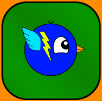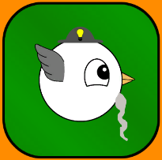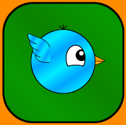

The potions take inspiration from RPG's and focuses on rejuvenation. Below are shown the Life Potion and the Elixir of Immortality.

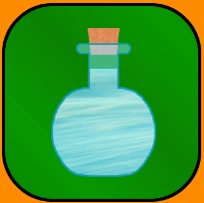

The special abilities are inspired by MOBA's and has a unique effect that can be combined with the other special abilities. 
Below are shown the force field, the super dash, the multiplier and the dimension shifter.

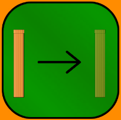

The boosts are inspired by launch games, that quickly gets you to where you need to go. 
Below are shown the headstart major and headstart minor.

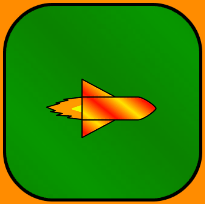

The worlds are quite different and features their own unique environment. 
The idea with the worlds is to move through different environments, gradually getting higher and higher until we reach space. 

#### World 1 - Cozy Meadow
Cozy Meadow features grasslands with a lake, bordering up to a mountain range with a blue sunny sky. 
This is combined with sounds of a flowing lake and birds singing to give an ambience of serenity and peace.

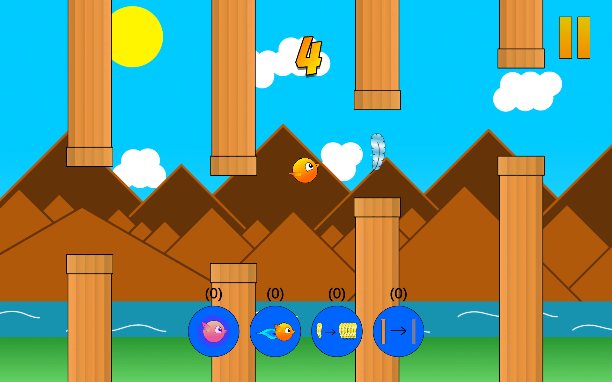

#### World 2 - Gothic Dungeon
Gothic Dungeon features a dusty old dungeon lit up with torches, with huge spiders crawling on spiderwebs and a gate out to freedom which is forever locked. 
This is combined with sounds of wind, knocks and scraping, a tamburine, thunder, rain and crows cawing to give an eerie feeling. 

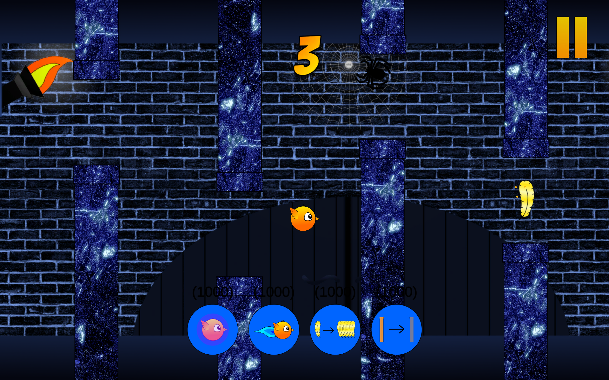

#### World 3 - Volcanic Biome
Volcanic Biome features a lava bed with active volcanoes in the background, complete with smoke and dark clouds. 
This is combined with sounds of boiling lava and explosions to give a sensation of being at the precipice of incredibly hot, active volcanoes. 

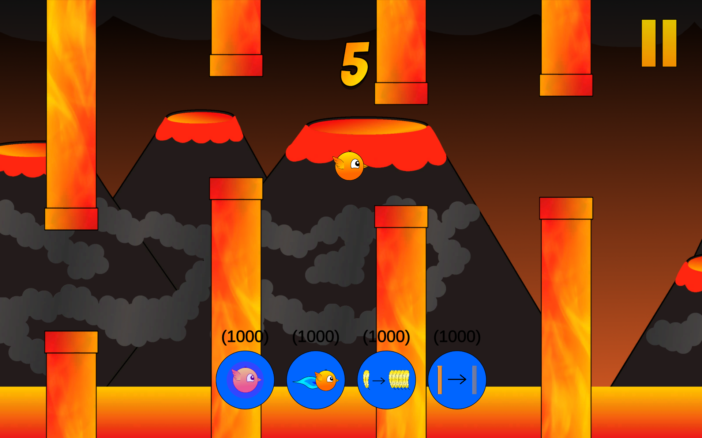

#### World 4 - Fungal Forest
Fungal Forest features mushroom trees with vines hanging down and small magical mushrooms on a bed of blue grass. This is combined with various special wild life sounds to give a feeling of mystery. 

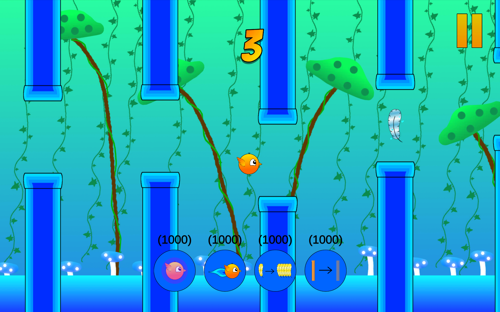

#### World 5 - Icy Cave
Icy Cave features icebergs, iglos, icicles and falling snowflakes, combined with sounds of arctic wind and cracking icicles to give a feeling of chill.  

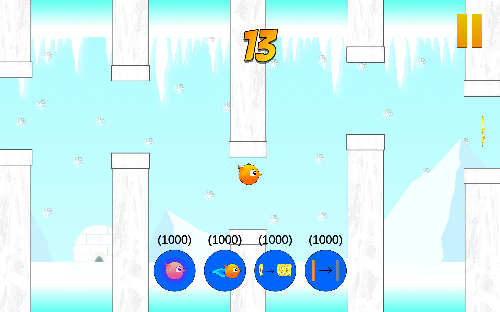

#### World 6 - Sky Realm
Sky Realm floating islands with biomes of a forest, a jungle and a desert, with wild plants growing on the ground. This is combined with wind and jungle noises to give the sensation of being on a jungle island in the sky. 

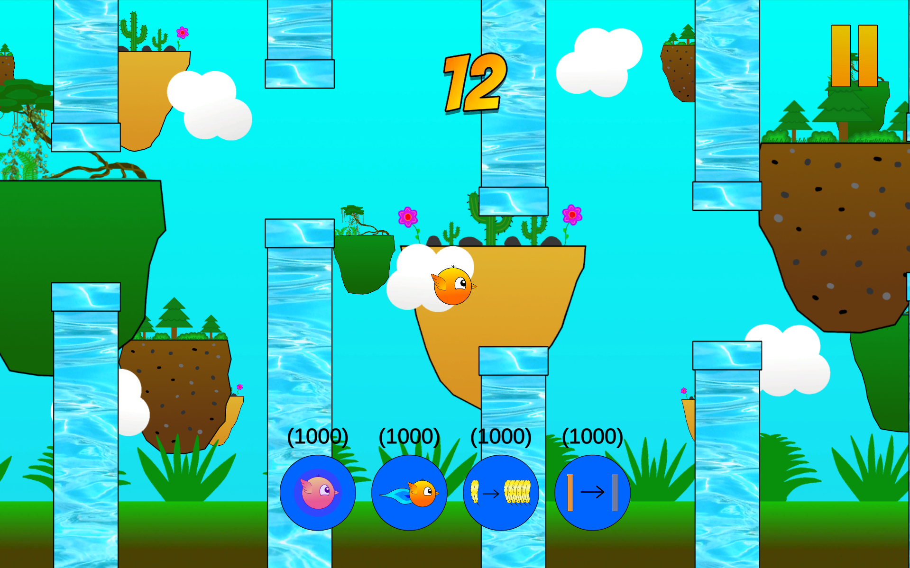

#### World 7 - Heaven
Heaven features a heavenly gate with angel birds sitting on top of clouds. This is combined with sounds of a heavenly choir to give the sensation of holyness.  

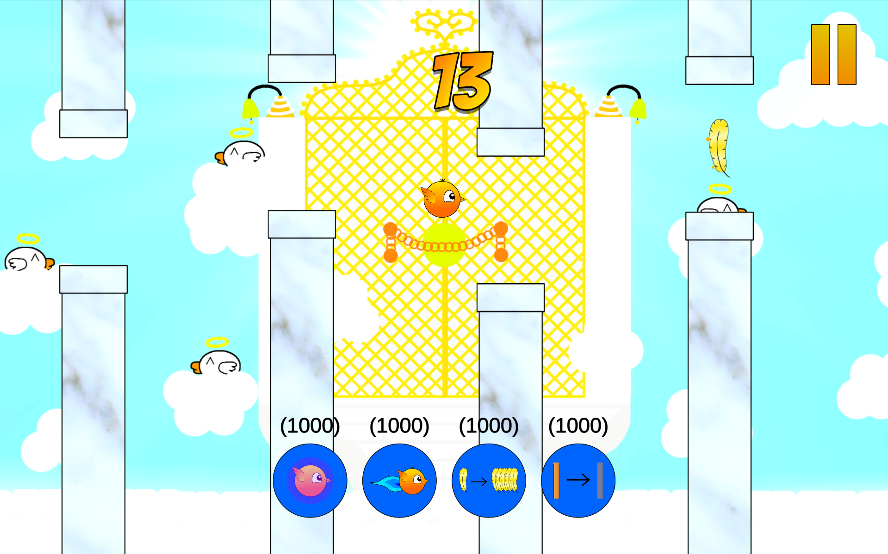

#### World 8 - Space
Space is a starry sky with the Sun, Earth, Mars and meteors flying by, where the ground is an asteroid flying through space. This is combined with a sound of a hollow wind and meteors to give a sensation of the vastness of space. 

## Trailer
Shows a brief overview of what the game has to offer.

   

## Overview
Click the image below to see a video walkthrough of the different elements in the game.

  

## Play the game
You can play the game by downloading the game files from itch.io free of charge --> 
[Play the Game](https://avillion.itch.io/adventures-of-chirpie)

