# **Adventures of Chirpie**

**Endless runner featuring 8 unique worlds, collectible feathers, powerups, upgrades, and a variety of player characters. Collect daily rewards, play slot machine minigames, and acquire trophies by hitting high scores.**

---

## **Trailer**
Brief trailer introducing the highlights of the game. 

---

## **Full Walkthrough**
Full walkthrough of every element in the game, including worlds, mechanics, powerups and more. 

  

---

## **Quick Links**
- [Game Architecture](#game-architecture)
- [Game Worlds](#game-worlds)
- [Player Characters](#player-characters)
- [Powerups & Boosts](powerups-special-abilities--boosts)
- [Collectibles](#collectibles)
- [The Golden and Diamond Slot Machines](#the-golden-and-diamond-slot-machines)
- [Achievements](#achievements)
- [Daily Rewards](#daily-rewards)
- [Lessons learned](#lessons-learned)
- [Credits & tools](#credits--tools)
- [Play the game](#play-the-game)
- Other projects I have made: [Portfolio Website](https://lucashoffschmidt.github.io/)

---

## **Game Architecture**
The game is constructed using a single scene and manager game objects handling logic, objects and optionality of a given field of the game.
Managers activate and deactivate objects as needed, using references in the scene. 
The AchievementsManager handles achievements, the AudioManager handles sounds and ambience, the SaveManager handles the save state and preferences and so on. 
The top manager is the GameManager, which keeps an overview of the entire game state, such as what has been unlocked, if the game has been paused and how many powerups the player has. 

**Navigation**

- The player starts from the start menu. 

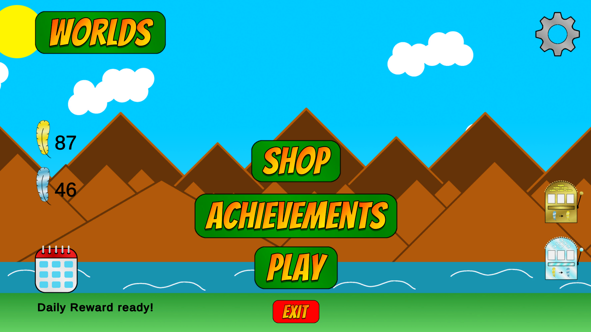
 
- From here they can change world, enter the shop, see their achievements and access their daily reward. 

- They can also play minigames, adjust their settings, see their stats and how to play. 

- It is also from here they can enter a new run, specifying their player character and booster. 

- If the player dies, they may choose to continue by using a potion or end the game. 

- If they end the game, they will see their highscore and greatest trophy. From here they can return home to the start menu, quickly enter a new run, or see their achievements. 

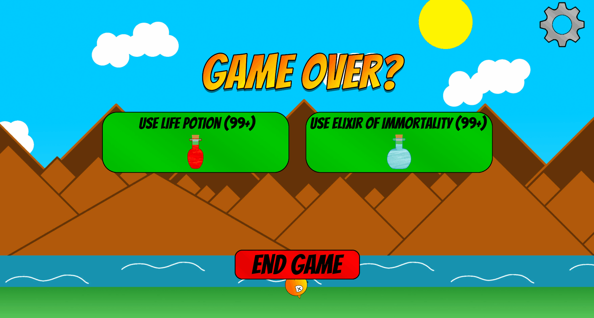

## **Game Worlds**

**Overview:** 8 unique worlds, each with its own art style and ambience. Players fly endlessly through these environments, collecting feathers and using powerups as they try to avoid colliding with pipes and the ground.

### **Worlds Overview** 
From the worlds window, the player can see a preview of each world, a short description and travel to unlocked worlds. 
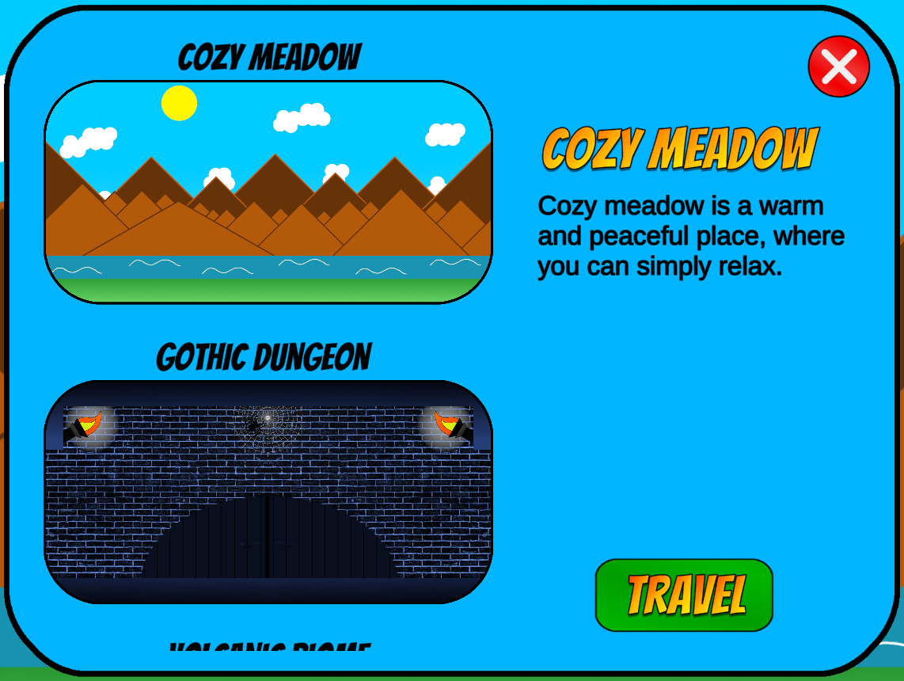
 
Worlds are unlocked by achieving a certain highscore and acquiring it with feathers (ingame currencies).
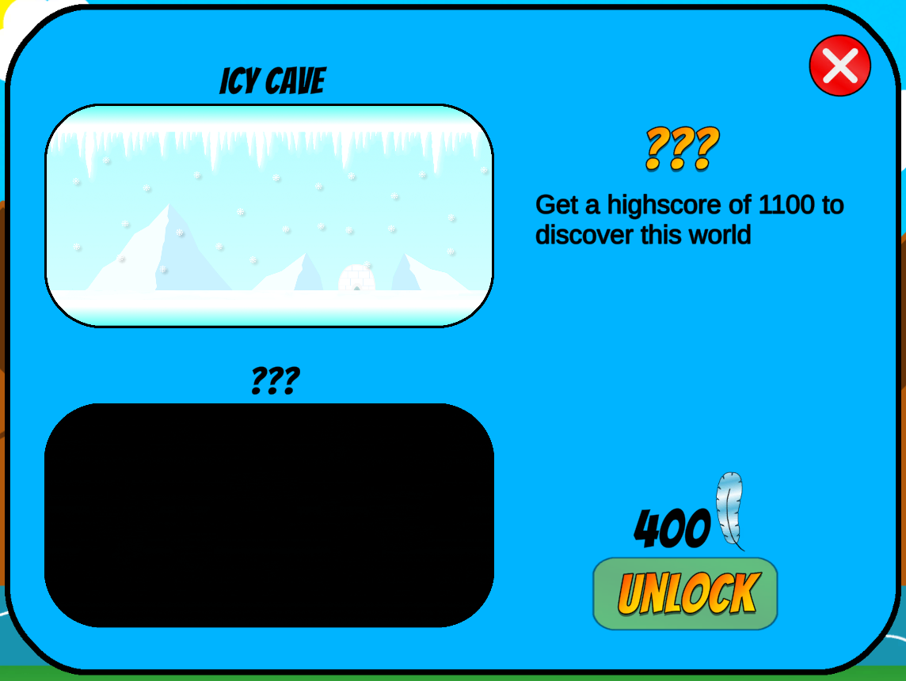

### **Cozy Meadow**
Cozy Meadow is the first world. My focus here was to start off with a calm and safe environment, where the player could feel comfortable and at ease. 
The world features a green meadow with a slow flowing creek, surrounded by mountains that watch over you, gentle clouds and warmth from the sun.

In the background we have a soundscape of birds singing, marking the beginning of a new day, where anything is possible as well as the slow flow of a creek.  

The pipe is a wood pipe, symbolizing trees. 

   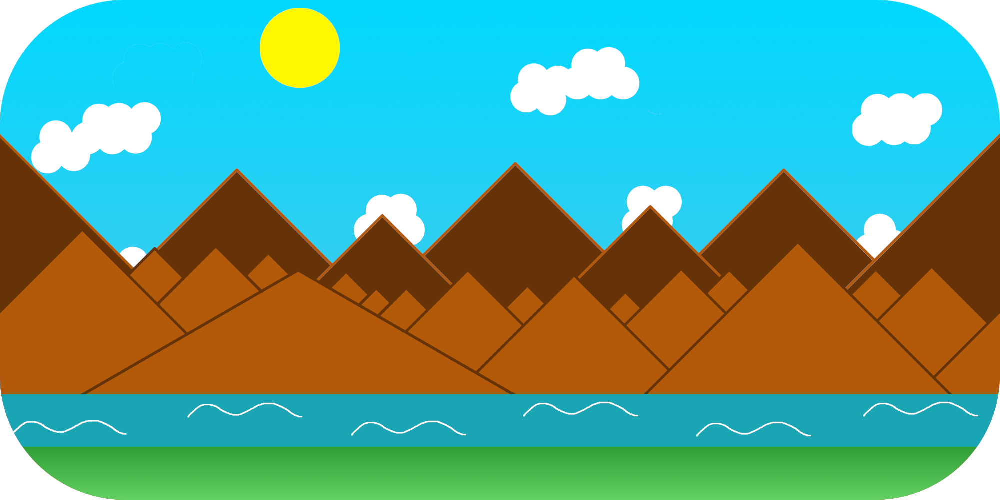
   

https://github.com/user-attachments/assets/b6ec3d21-3d4d-4995-957f-599417052cfa

### **Gothic Dungeon**
Gothic Dungeon is the first world the player is able to unlock. Here I wanted to do the opposite of everything Cozy Meadow stood for. 
It features a dark and creepy dungeon with a closed gate, signaling that you are in prison, with flickering torches providing just a little light, but not enough to illuminate the darkness that surrounds you. 
We have a dark brick wall and a spider crawling in a spider web towards a fly in the middle of the web.
Just like the fly, the idea is that this world should make you feel trapped. 

In the background I have made an eerie mix of sounds to give the impression of being somewhere very desolate, old and abandoned. 
The world has 2 different wind sounds, knocks and scraping, a tambourine, thunder, rain and crows cawing.   

The pipe is a black marble pipe, symbolizing pillars. 

   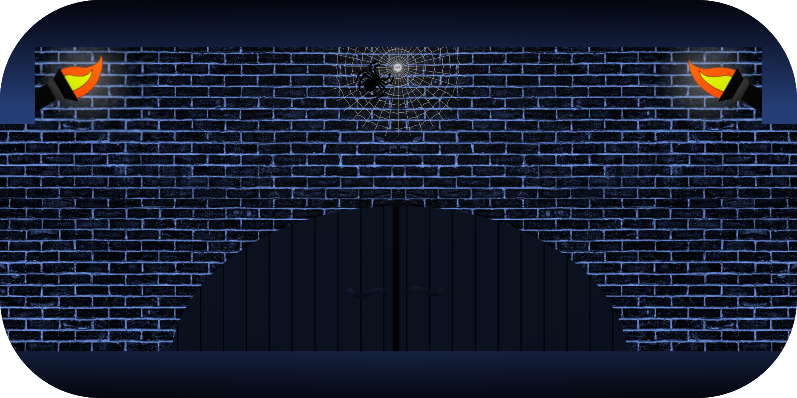
   

https://github.com/user-attachments/assets/43d7da42-a85d-4751-9f87-6d5ca2f12135

### **Volcanic Biome**
For the third world I decided that it was time for a change and cranked up the heat, literally. 
The third world is called Volcanic Biome and is filled with exploding volcanoes, ash and smokey clouds. 
The ground is bright orange to signify that we are flying along the edge of a volcano. 

In the background we have sounds of boiling lava and explosions. 
The sound of boiling lava was made by recording bubbling oatmeal.  

Here the player should think that they have entered a hostile wasteland, where they need to keep moving in order to avoid the lava from the exploding volcanoes.

The pipe is a magma pipe, symbolizing the constant flow of magma. 

   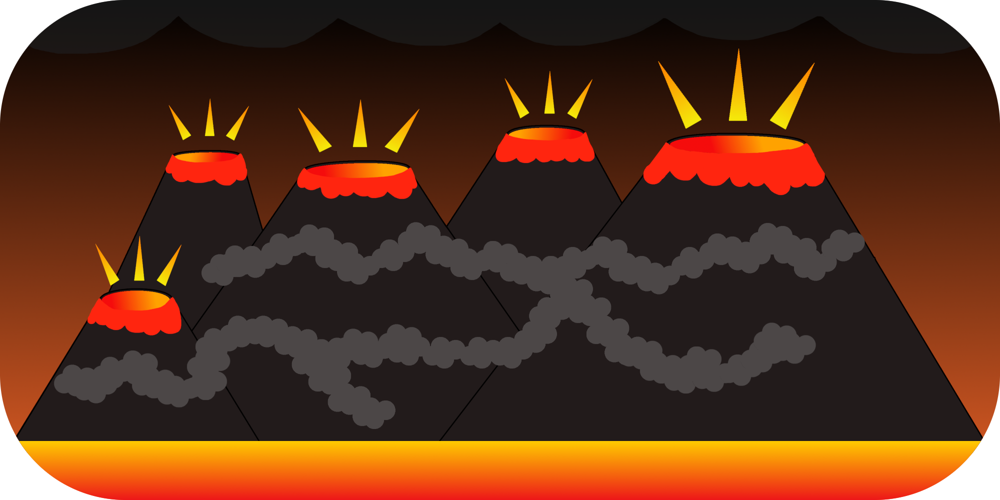
   

https://github.com/user-attachments/assets/79774da2-6434-452b-b925-6e5a595fb3a7

### **Fungal Forest**
Fungal Forest features a mysterious forest with giant swaying green fungus trees and poisonous looking small blue mushrooms, vines hanging from canopies and a blue ground. 
The blue ground is actually grass, but the poisonous blue mushrooms have changed its color over the course of many years. 

In the background we have jungle sounds, where I have played around with sound design to give the sensation that you are in an alien forest, surrounded by all sorts of creatures you can't identify.

The idea here is to introduce a little mystery to the player, by showing them an environment out of the ordinary. 

The pipe is a mushroom pipe, symbolizing tall mushrooms. 

   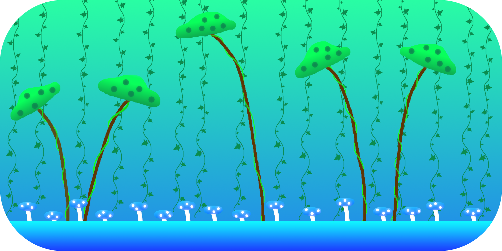
   

https://github.com/user-attachments/assets/3f6dc4cb-142c-4ab6-8a9e-fa8e00238f83

### **Icy Cave**
Icy Cave stands in contrast to the Volcanic Biome. It contains freezing icicles, falling snowflakes, icebergs and an igloo. 

In the background we have the sound of a strong wind and 4 different sounds of ice cracking, made by breaking branches. 

The player should feel chilled to the bone here, and incentivized to keep flying to keep warm and avoid falling icicles. 

The pipe is an ice pipe, symbolizing stalagmites and stalactites. 

   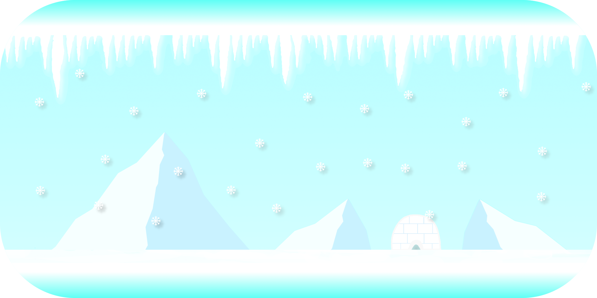
   

https://github.com/user-attachments/assets/5fa046d3-98fa-4e8d-b951-24f795d0e03a

### **Sky Realm**
Sky realm features a floating island high in the sky. It has a view to many other floating islands of three types: Desert, forest and jungle. 
The green ground with interesting looking plants, signifies that we are on a jungle island.

In the background we have a simple sound of wind in leaves. 

We have now begun a new theme, where the player moves higher and higher up in the world. 

The pipe is a water pipe, symbolizing the lushness of the environment. 

   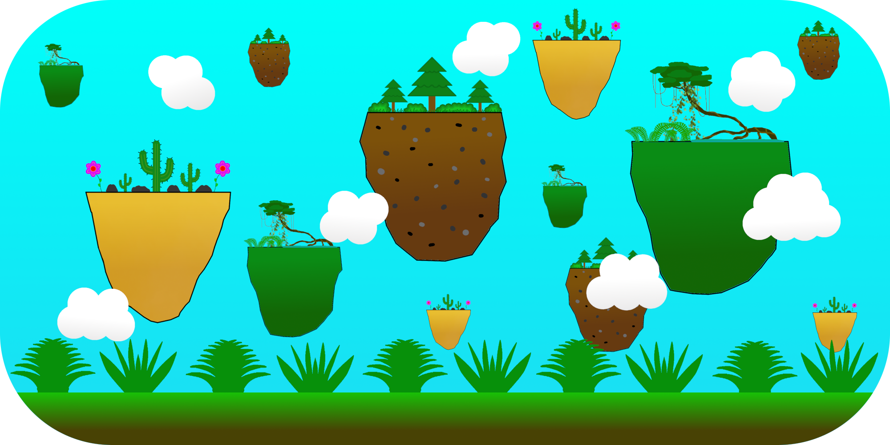
   

https://github.com/user-attachments/assets/97a6af8f-518e-4f57-b39f-605658a73cd2

### **Heaven**
The player has kept flying and has now reached heaven, complete with the stairway to the pearly gates, angel birds and clouds. 

In the background we have sounds of a heavenly choir to give a feeling of awe. 

The player should feel a sense of calm here as they are nearing the end of their journey. 

The pipe is a white marble pipe, symbolizing pillars. 

   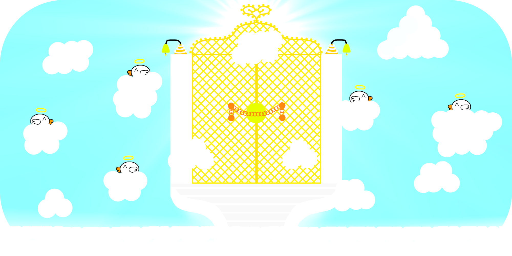
   

https://github.com/user-attachments/assets/49e31de2-0403-426f-a9e1-120ba1ca0bfc

### **Space**
Finally we have space, the end of the players journey. Space features the grand night sky, the earth, mars and the sun.
The ground signifies an asteroid moving through space. 

In the background we have the sound of a monotonic wind, to give a sense of big vastness of space. 
We also have sounds of meteors occassionally flying by, made by editing a recording of cars speeding by. 

Now at the end of their journey, the player looks down upon the world they used to belong to and acknowledges just how far they have come. 

The pipe is a starry pipe, symbolizing the multitude of stars that inhabit the universe. 

   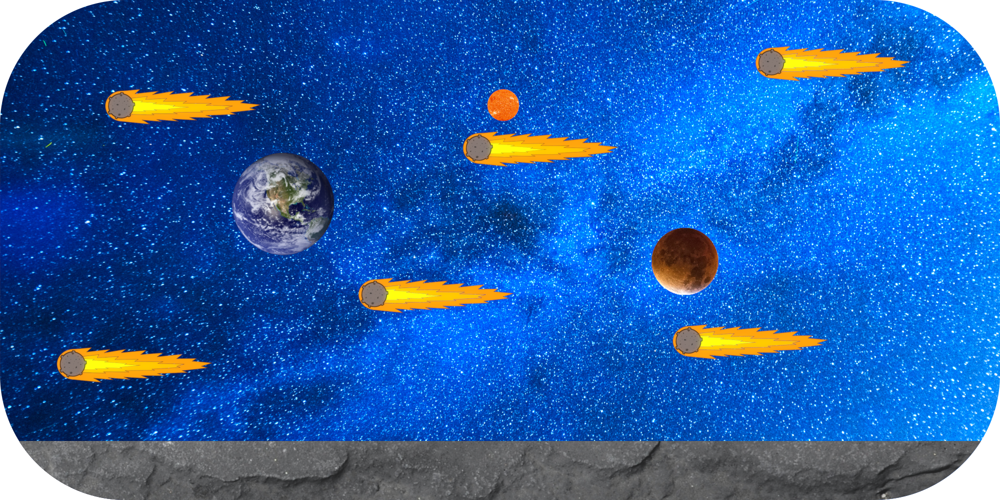
   

https://github.com/user-attachments/assets/42adb83d-203f-47d5-8b31-80f7ba9fbebb

---

## **Player Characters**
The player characters are circular birds symbolizing harmony, with different colors and traits. 
They have small, fluffy wings and big eyes. 
The symbolism is that the player is just one little bird against the world, but no matter how small you are, if you persevere through the obstacles in your way, you can achieve great feats.  

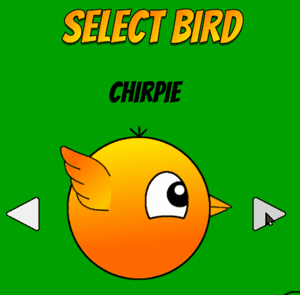

Player characters are acquired through the shop. 

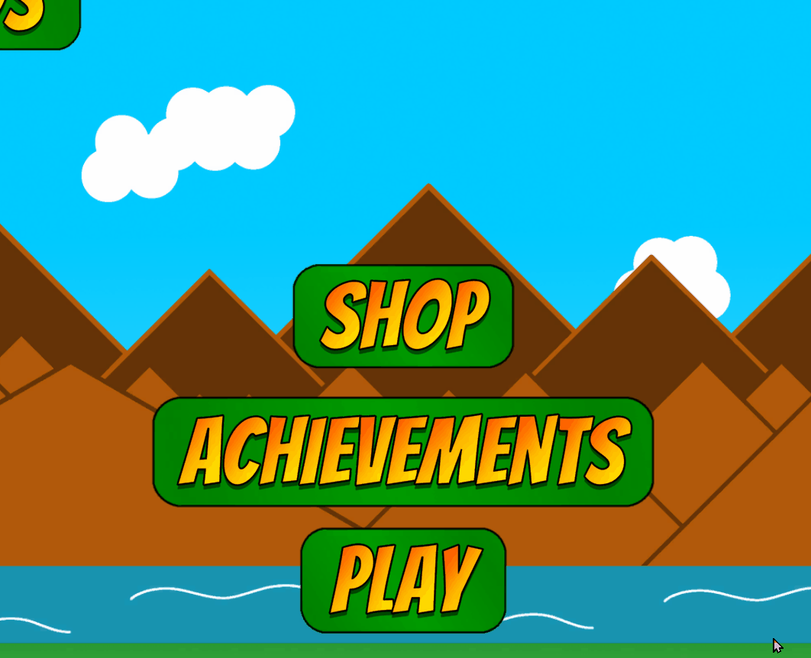

Every bird has two main abilities of flying and levitating and is vulnerable to the ground and pipes. 

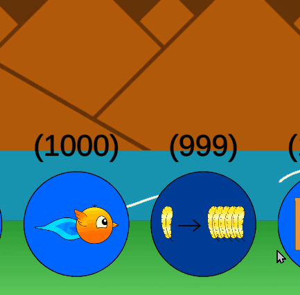

---

## **Powerups, Special Abilities & Boosts**
The powerups, special abilities and boosts have been made with inspiration from a variety of games. 

### **Potions**
The potions take inspiration from RPG's, where a potion can restore your health, or temporarily boost your abilities.
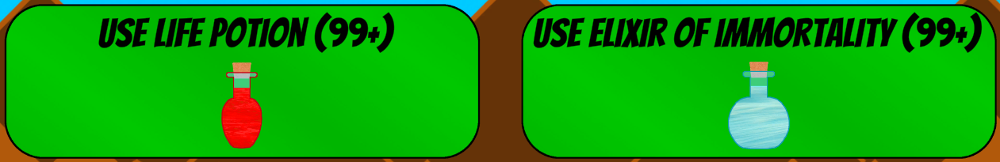

The life potion lets you continue the run from the score where you died. 
The elixir of immortality takes this one step further and starts you off with 30 seconds of immortality.

### **Special Abilities**
The special abilities are inspired by MOBA's, where each ability can be combined for even greater effects.
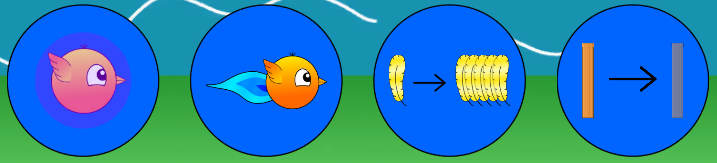

The force field allows you to take 3 hits without dying. 
The superdash lets you quickly advance 20 pipes. 
The multiplier makes feathers appear for every pipe, rather than for every 5th pipe. 
The dimension shifter makes the pipes transparent, allowing you to go straight through them. 

### **Boosts**
The boosts are inspired by launch games, that quickly give you a headstart. 

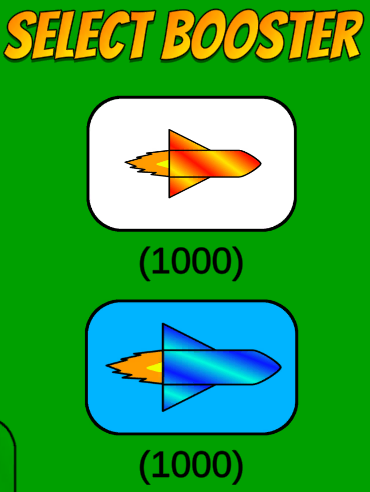

The headstart minor will let you start a run around pipe 50. 
The headstart major will let you start a run around pipe 100.

### **Purchasing and Upgrading**
Powerups, special abilities and boosts can be purchased and upgraded from the shop. 

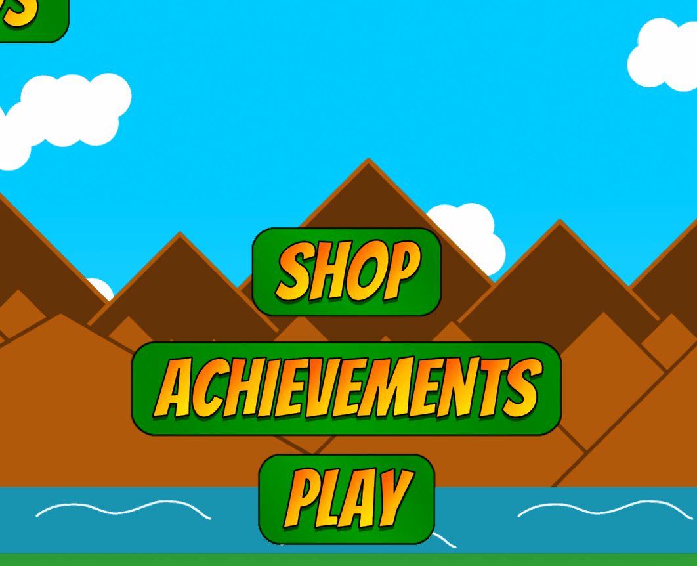

---

## **Collectibles**
Golden feathers and diamond feathers can be collected through runs, at every 5th pipe by default. 
1 diamond feather is worth 10 golden feathers. 
They have a rotating animation and a glittering particle effect surrounding them, signifying their value.

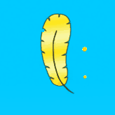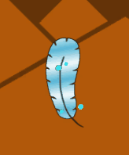

When you acquire a feather a sound effect is played, based on whether it was a golden or diamond feather. 
The golden feather has a bright melody and the diamond feather an even brighter melody, so you can auditively clearly hear the difference.

Feathers can be used to unlock new player characters, buy powerups and acquire upgrades to powerups, boosts and special abilities. 
They can also be used in the slot machines for a chance to acquire even more feathers. 

---

## **The Golden and Diamond Slot Machines**
The slot machines are used to introduce variation, when the player is exhausted after a run, they can sit back and let the machine run for a chnage.
On the slot machine window, you can see how much it costs to play, and on the side the potential rewards you get for playing. 
You play by clicking the pull button, which starts the reels with a rotating sound and a celebratory sound if you win.

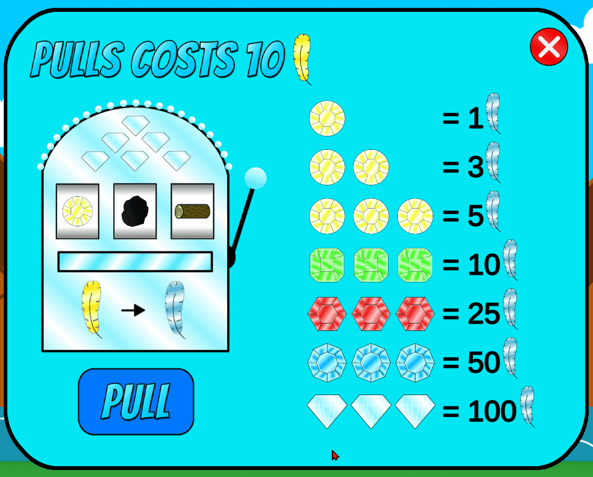

The slot machines take inspiration from actual casino slot machines with lights at the top, the long pullbar and the sounds of reels rotating and celebration.  

## **Achievements**
I have made custom ingame achievements, which can be seen under the achievements window. 
It features a tally, showing you how many achievements you have, and how many you are missing. 
Each achievement has a unique name, logo, description and comment. 
Once you unlock an achievement you acquire a reward of golden and diamond feathers.  

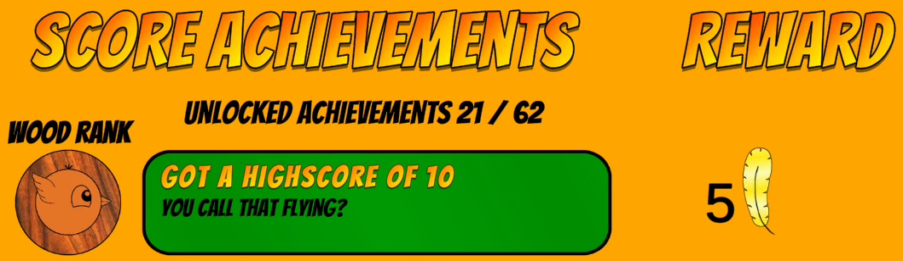

Initially the description and comment of achievements are hidden, but once the achievement has been made accomplished, the description and comment will be shown. 
Standard hidden achievements are darkened, while unknown achievements related to worlds, player characters and feathers are completely black, to incentivize the player to acquire them. 

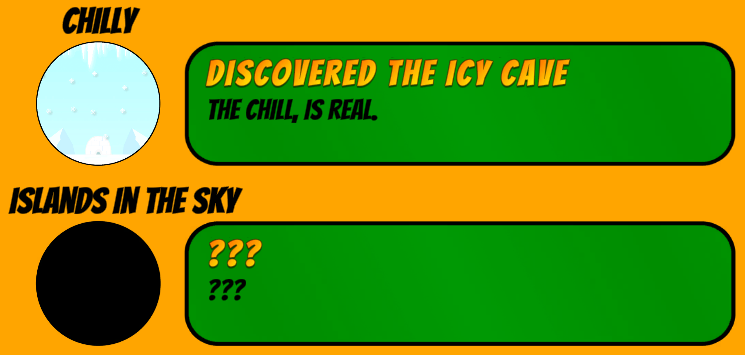

When the player unlocks an achievement, an overlay will appear at the top of the screen, with its name, logo, description, comment and reward. 

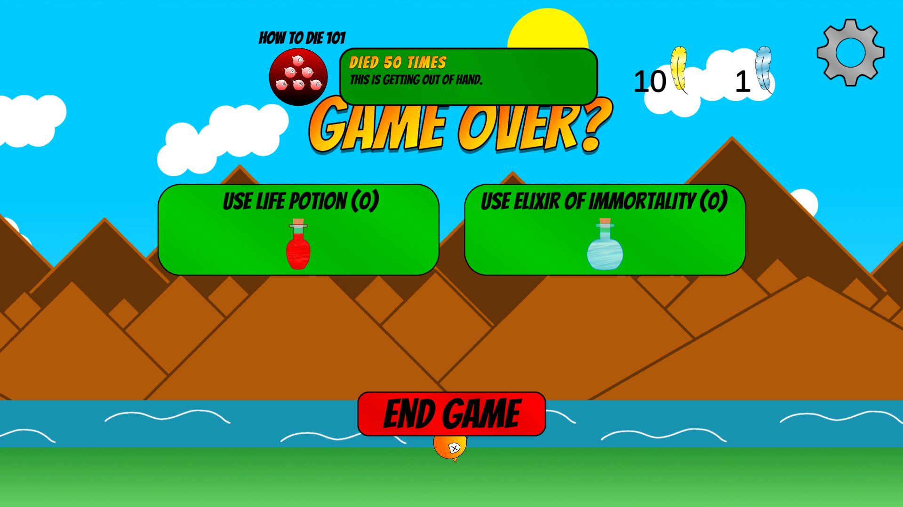

## **Daily Rewards**
If the player returns each day, within the day, they can acquire gradually better daily rewards. 
After 2 weeks they unlock a mystery reward. The purpose of this is to get them to come back day after day to figure out what the mystery is.  
The sound of unlocking a daily reward has a pleasant rising tone. 

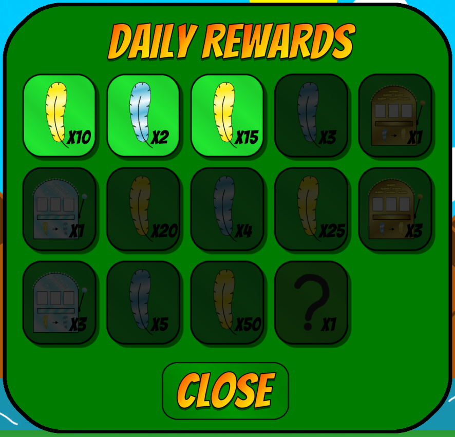

---

## **Lessons Learned**
This was the first game I ever created. I didn't even know how to code when I started, so I scrambled initially, looking through stack overflow, forums and youtube, trying to figure out how everything worked. 

I dealt with everything from missing or broken dependencies, to the game being unable to start, because a little option wasn't ticked. 

Creating this game has taught me that perseverance pays off, and that any problem can be solved, by looking at it from the right perspective. 

---

## **Credits & Tools**

**Tools Used:**

* **2D art** GIMP
* **Ambience:** FL Studio, Audacity
* **Sound Effects:** Bfxr
* **Game Development:** Unity
* **Trailer Production:** Shotcut

**Third Party Sites**
Freesound.org was used for sound effects and world ambience. 
Unity Forums, Stack Overflow and Youtube was used for problem solving and inspiration.

## Play the game
You can play the game for free here --> 
[Play the Game](https://avillion.itch.io/adventures-of-chirpie)
